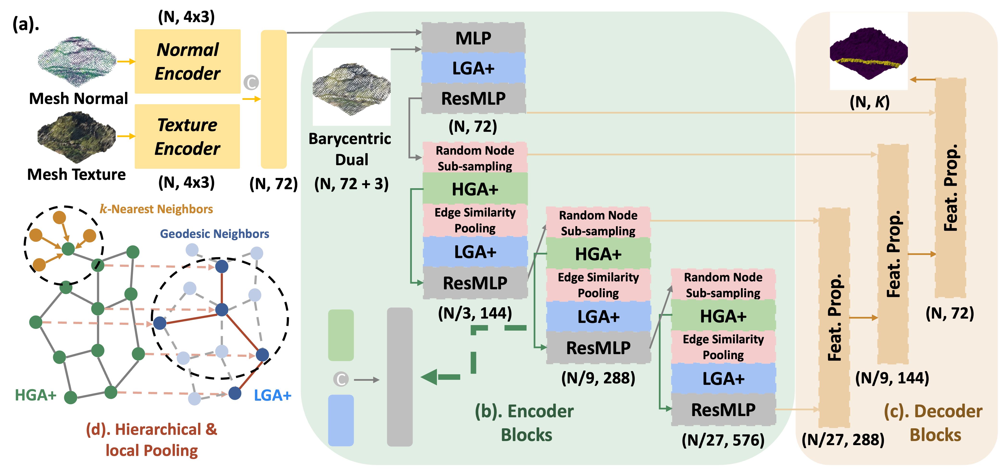
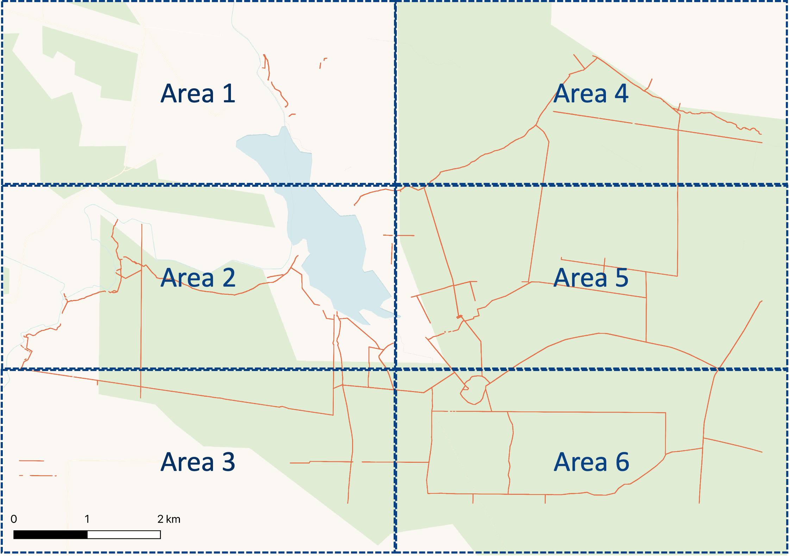

# LMSeg: A deep graph message-passing network for efficient and accurate semantic segmentation of large-scale 3D landscape meshes

## Abstract

Semantic segmentation of large-scale 3D landscape meshes is crucial for various geospatial applications, such as spatial analysis, automatic mapping, target object localization, and urban planning. This task requires an efficient and accurate 3D perception system to interpret and analyze real-world environments. However, traditional mesh segmentation methods face challenges in accurately segmenting small objects and maintaining computational efficiency due to the complexity and large scale of 3D mesh datasets. This paper presents LMSeg, an end-to-end deep graph message-passing network designed for efficient and accurate semantic segmentation of large-scale 3D landscape meshes. The proposed approach leverages the barycentric dual graph of meshes as input and applies deep message-passing neural networks to hierarchically capture geometric and spatial features from barycentric graph structures, learning expressive semantic information from textured meshes. LMSeg’s hierarchical and local pooling, along with its geometry aggregation modules, enable fast inference and accurate segmentation of small and irregular mesh objects in complex landscapes. Extensive experiments on two benchmark datasets, SUM (urban) and BudjBim Wall (natural), demonstrate LMSeg’s strong performance, achieving 73.0 mIoU for urban segmentation and 59.5 mIoU for natural stone wall segmentation with a compact model size (1.7 million training parameters). Notably, LMSeg excels at segmenting small objects in complex urban and natural environments, achieving 93.4 mIoU on high vegetation and 71.5 mIoU on vehicles, while effectively detecting irregular and small stone wall structures in complex natural landscapes.

## Architecture


Overall architecture of LMSeg. (a). Input mesh is converted into barycentric dual graph with mesh texture and face normal features. (b). LMSeg encoder consists of random node sub-sampling, HGA+, edge pooling and LGA+ modules for hierarchical and local feature learning. A residual MLP takes concatenated LGA+ and HGA+ features as inputs and updates graph node features. (c). LMSeg decoder consists of feature propagation layers, which progressively up-sample the size of deep encoder features back to the original input size. $\texttt{N}$ denotes the number of input nodes of barycentric dual graph, and $\texttt{C}$ refers to the input node feature dimensions.

## **Installation**

Conda environment to run the code has exported to **requirements.yaml**.

## **Dataset**

```text
data
├── BudjBimWall
│   ├── mesh
│   │   ├── area1
│   │   ├── area2
│   │   ├── area3
│   │   ├── area4
│   │   ├── area5
│   │   ├── area6
│   │   └── processed
│   │       ├── area1
│   │       ├── area2
│   │       ├── area3
│   │       ├── area4
│   │       ├── area5
│   │       └── area6
│   └── pcd
│       ├── area1
│       ├── area2
│       ├── area3
│       ├── area4
│       ├── area5
│       └── area6
├── SUM
    ├── processed
    │   ├── test
    │   ├── train
    │   └── validate
    └── raw
        ├── test
        ├── train
        └── validate
```

## **Budj Bim Wall Dataset**

Budj Bim Wall (BBW) dataset is a lidar-scanned point-cloud dataset of the UNESCO World Heritage cultural landscape covered by the Budj Bim National Park in southwest Victoria, Australia. This is one of the areas with the highest density of European historic dry-stone walls in Australia. The dataset was collected in 2020 by the Department of Environment, Land, Water and Planning in Victoria, Australia for the Gunditj Mirring Traditional Owners Corporation.


<p align="center"> The entire Budj Bim landscape (301 km^2 area) collected by aerial lidar point clouds, containing 33 billion points.</p>

The BBW dataset is a subset of the full dataset, capturing the northern part of the data. It is spatially divided into six equal, rectangular areas, where areas 1, 3, 5, 6 are part of the training set (2633 tiles), area 4 is the validation set (716 tiles) and area 2 is the test set (647 tiles). Each tile in BBW dataset is a textured landscape mesh of 400$m^2$ map area (with face density of ~45 faces/m$^2$) semi-manually annotated into binary semantic labels (wall vs. other terrain).


<p align="center"> Data splitting of Budj Bim Wall dataset. Train set: Area 1, 3, 5, 6 in blue, dotted rectangles. Validation set: Area 4 in the red, solid rectangle. Test set: Area 2 in the red, solid rectangle. Annotations in orange lines denote the spatial locations of European historic dry-stone walls located near Tae Rak (Lake Condah), Victoria, Australia.</p>

The textured mesh tiles of BBW dataset are constructed from filtered ground surface points resulting from ground/non-ground classification by the data producer. The mesh 2.5D surface is constructed by [Delaunay triangulation](https://github.com/hugoledoux/startinpy/) of the ground surface 3D points. The texture (color information) of the colorized lidar point clouds is projected onto the mesh faces.

Given the large area and high point density of the Budj Bim landscape, the [Semi-Automatic Classification Plugin](https://plugins.qgis.org/plugins/SemiAutomaticClassificationPlugin/) from QGIS, developed for the annotations of remote sensing images, are adopted for data anootation. This tool enables the creation of binary masks (0: Terrain, 1: Stone wal) on the xy-axis of stone wall stcutres. Additionally, for height-based stone wall annotation on the z-axis, a 2-meter height-above-ground constraint was applied to exclude points exceeding this height threshold.


<p align="center"> The annotated stone walls (in lidar point clouds) of BBW dataset.</p>

## **Model Training**

```bash
python3 train/train_lmseg_sum.py --cfg=cfg/sum/lmseg_feature.yaml
```

or

```bash
python3 train/train_lmseg.py --cfg=cfg/bbw/lmseg_feature.yaml
```

## **Evaluation**

Pre-trained models are located at:

```bash
save/sum/lmseg_feature/ckpt/epoch{}
```

or

```bash
save/bbw/bbw_lmseg_feature/ckpt/epoch{}
```

## Results


<p align="center"> Qualitative performance of LMSeg on SUM dataset.</p>


<p align="center"> Qualitative performance of LMSeg on Budj Bim Wall dataset.</p>

## Citation

```text
@misc{huang2024lmsegdeepgraphmessagepassing,
      title={LMSeg: A deep graph message-passing network for efficient and accurate semantic segmentation of large-scale 3D landscape meshes}, 
      author={Zexian Huang and Kourosh Khoshelham and Gunditj Mirring Traditional Owners Corporation and Martin Tomko},
      year={2024},
      eprint={2407.04326},
      archivePrefix={arXiv},
      primaryClass={cs.CV},
      url={https://arxiv.org/abs/2407.04326}, 
}
```
